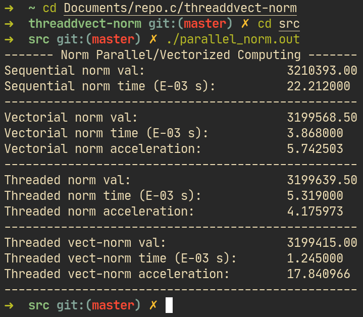

# threaddvect-norm
An academic project used to get familiar with POSIX threads and vectorization using AVX intrinsics.

The routine this project is trying to parallelize is some norm computing:


### Usage
If you're on a Unix or Unix-like system, you can just use the makefile provided under the src/ directory:

``` shell
cd src/
make
./parallel_norm.out
```

### Execution example
<em>Note that the result inconsistency is due to the use of single-precision floating-point format (float / 32bit pres).</em>


